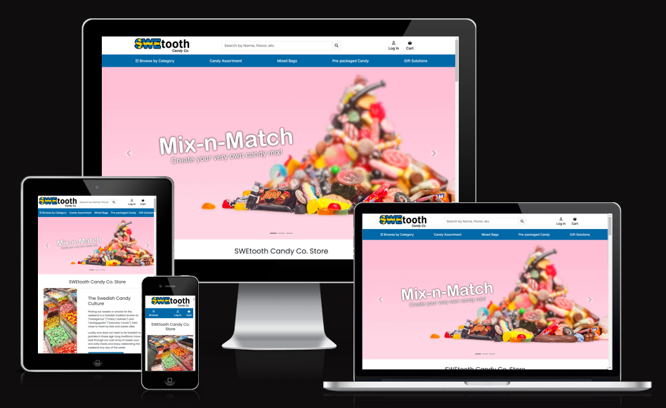
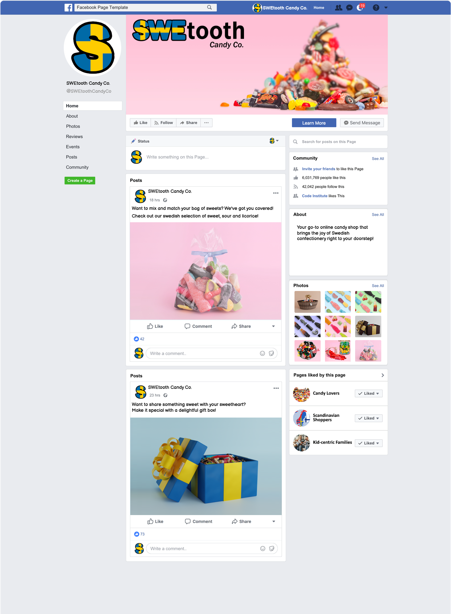
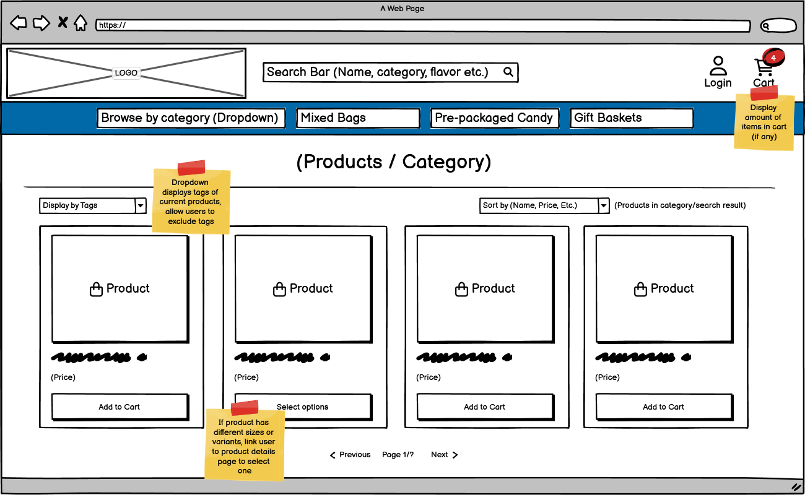
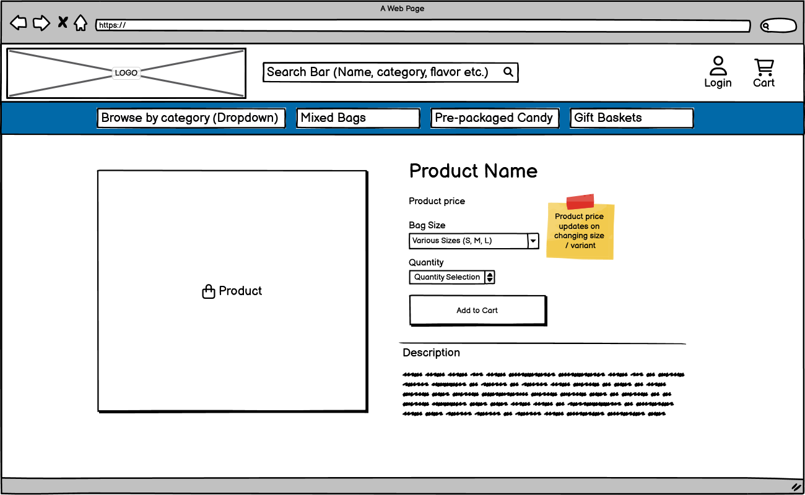
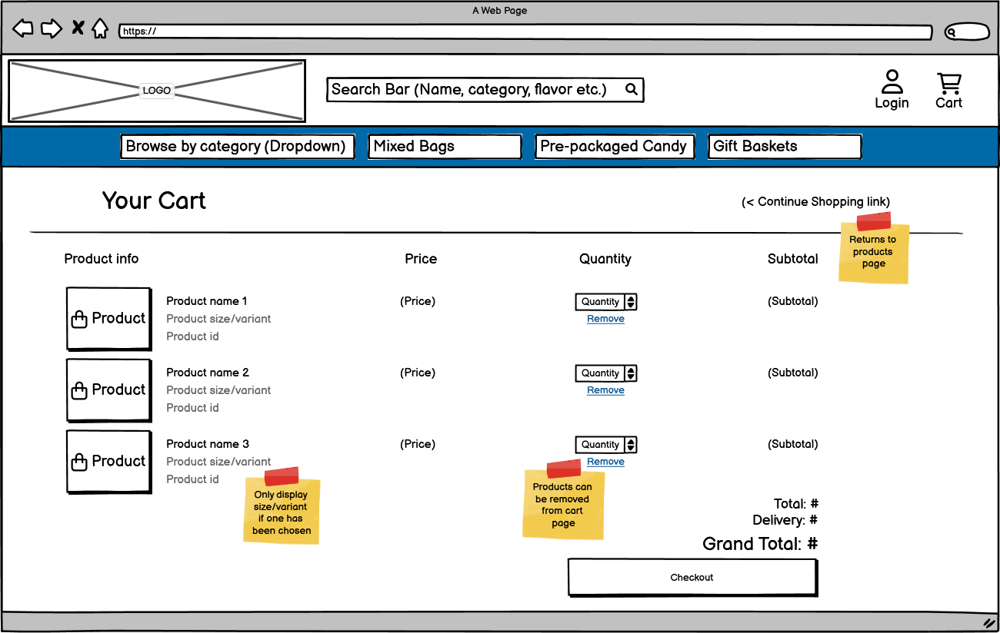
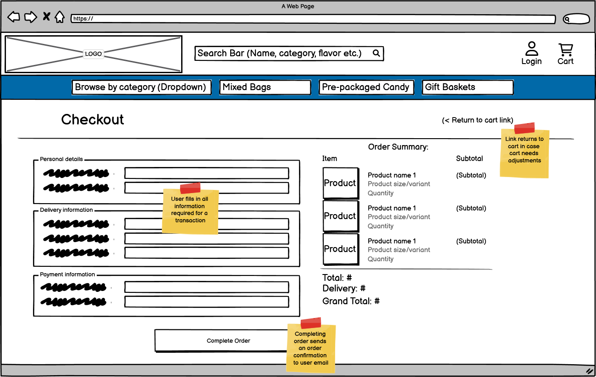
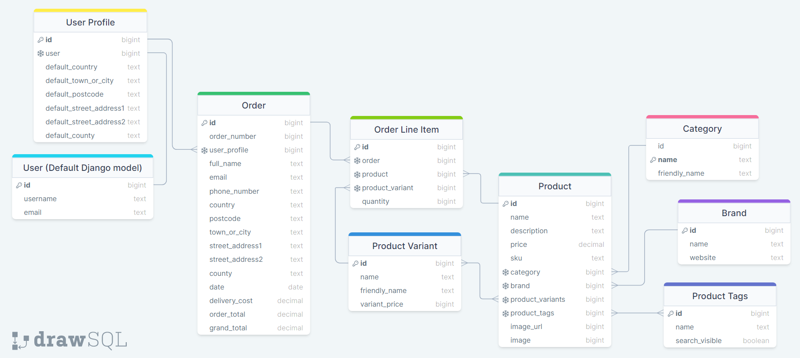
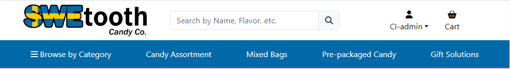
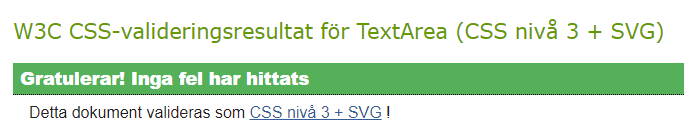
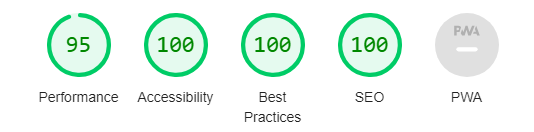

# SWEtooth Candy Co. Shop
[SWEtooth Candy Co. Shop](https://swetooth-candy-co-c66a5c7b1ddf.herokuapp.com/) is an online candy store that brings the joy of Swedish confectionery right to your doorstep.
Whether creating your own candy mix or choosing from our pre-mixed selection, you're sure to find something sweet to your liking.



## Table of Contents
?TABLE OF CONTENTS:

## UX

### User Demographic

SWEtooth Candy Shop was built for candy enthusiasts ages 18-50, adults looking for a taste of nostalgia, young adults celebrating special occasions or curious individuals simply looking to explore Swedish candy traditions.<br>
As candy is *(and has always been)* a favourite amongst children, kid-centric families with ties to Sweden or Scandinavia are also an important demographic.<br>

As Swedish confectionery is readily available in most Swedish supermarkets, our demographic will primarily be outside of Sweden. 
This means all purchases will be delivered by shipping package, and as such the store offers gift solutions such as gift wrapping/boxes/baskets to turn their otherwise plain order into something more vivid and memorable.

### Business Model

SWEtooth Candy Co. operates on a Business-to-Customer (B2C) model, focusing on providing a simple and enjoyable shopping experience for the customer, with a goal of fostering return visits.

As customer retention is a primary concern, interacting with customers and building a connection through social media has become an integral part of SWEtooth's marketing strategy.
Not only does this help with customer retention, but it also attracts individuals and families who share similar tastes and preferences to our current customer base.
To further increase chances of return visits, our monthly newsletter provides insight into both newly added products, special offers and seasonal sales to garner interest.

SWEtooth Candy Co. uses Facebook as it's central marketing platform.
However, to avoid the risk of deactivation from Facebook due to being a non-authentic business page, I've opted to create a straightforward mockup in its stead.



### User Stories

The full project board can be found [here](https://github.com/users/AndreeeasN/projects/2)

#### As a visitor
- I can sign up so that I can store my order confirmations / billing info on my account
- I can recover my password so that I can keep using my account if I lose the password
- I can view specific categories so that I can easily find products I'm interested in without searching
- I can view product details so that I can see more information about my potential purchase
- I can select varying bag sizes so that I can order the amount I want
- I can add products to the cart so that I can purchase several products at once
- I can checkout the contents of my cart so that I can pay and receive my products

#### As an admin
- I can add/delete products so that the store can adjust what's being sold
- I can edit products so that the store can adjust product details
- I can sort through the admin menu so I can quickly find what I'm looking for

### Colour Scheme:
?COLOR SCHEME:

### Typography:
The following fonts were obtained from the Google Fonts Library:
- 'Inter' - used for the mobile and desktop navbar
- 'Poppins' - used for the general site content

The header logo was made using 'Franklin Gothin Medium'.

## Wireframes
- Home page<br>

- Products page<br>

- Product Details page<br>

- Cart page<br>

- Checkout page<br>


- While the design has mostly adhered to the initial wireframes, the "Browse by Category" button in the navbar was changed from opening a dropdown to opening a sidenav for stylistic reasons.

## Database Schema



## Features

### Existing Features

#### Navigation
<br>
- Header logo
    - Brings user to the home page on click
- Search bar
    - The Search bar allows the user to search for products by their name, description and product tags<br>
    
    - The search function is accessible from all pages, and the search results are displayed on the products page.
    - On smaller screens the search bar will be moved into the sidenav to save space.
- Mobile Navbar
    - On smaller screens the navigation bar only contains 3 elements: Browse, Login and Cart.
    - All hidden navigational elements are available from the Sidenav which can be opened using the "Browse" button
- Sidenav<br>
    
    - The side navigation can be opened by clicking "Browse by Category" from the desktop navigation bar, or the "Browse" button on mobile.
    - The sidenav contains all categories and a few subcategories.
    - All links lead to the products page using different category/tag/search criteria.
- Log in / Sign up<br>
    
    - When not logged in displays a link to log in or sign up
- Profile Name<br>
    
    - When logged in displays a dropdown menu where your user profile and log out button can be found.
    - If logged in as a superuser the "Add product" page and Admin Menu can be accessed from here.
- Cart<br>
    
    - Takes user to their cart on click
    - If cart currently contains items a red notification will be display the amount
        - "Cart" will also be replaced with the total of all contained items
- Back-to-top Button<br>
    
    - When scrolling a certain distance on longer pages, a button appears in the bottom right corner
        - Pressing this button will scroll back to the top of the page, helping the user should they want to scroll back to the top

#### Main Page
- Hero Image / Carousel<br>
    
    - A simple Bootstrap 5 carousel featuring 3 different images that can be scrolled through.
    - All images are clickable and lead to relevant pages.
    - Hidden on smaller screen sizes.
- Featured Content<br>
    
    - 3 cards featuring an image and some information about candy / available products.
    - All cards contain a link to their relevant pages
- Newsletter Signup<br>
    
    - Allows users to enter their email to subscribe to a monthly newsletter.
    - Signup is an embedded MailChimp form and redirects to a MailChimp confirmation page.
      - With a free MailChimp account, creating sign up confirmation emails is not possible and as such the mailchimp integration has been kept fairly basic.

#### Products Page

- Products<br>
    
    - Products are displayed in grid pattern showing the product's name and price
    - Each product has it's own "Add to cart" button
        - If the product has sizes / variants this will be replace with a "Choose Options" button that leads to the relevant product details page where a size can be chosen.
    - If logged in as superuser each product will have 2 extra options:
        - "Edit" - Allows the user to change details about the product (Name, price, category, brand, tags, sizes, image etc.)
        - "Delete" - Removes the product from the database entirely
- "Sort By" Dropdown<br>
    
    - Allows the user to sort their search by name and price, either ascending or descending
    - Displays how many products are present in the current category/search
- Pagination<br>
    
    - When the amount of products in a category/search exceeds a maximum they are split into pages and a page selection bar is displayed at the bottom of the products page.
    - The page selector allows the following actions:
        - Jump one page forward / back
        - Jump to the first / last page
        - Jump to a page within 3 pages of the current one

#### Product Details Page
- Product details<br>
    
    - Displays detailed information about the specified product
        - Product image, name, price, quantity selector, description and "Add to cart" are always visible
          - Product brand shows up if available, links to brand website
        - Size/variant selector only displayed when product has sizes/variants available
            - On selecting a variant the product price label will update to reflect this change
    - If logged in as superuser the page will have 2 extra options:
        - "Edit" - Allows the user to change details about the product (Name, price, category, brand, tags, sizes, image etc.)
        - "Delete" - Removes the product from the database entirely

#### Cart Page
- Your Cart<br>
    
    - Displays all items the user has added to their cart
        - Each product displays the following:
            - Name, SKU, price, quantity and subtotal
            - If product has a size/variant it will also be displayed
        - The quantity of each item can be adjusted using the - and + buttons followed by "Update"
        - The "Remove" link will entirely remove the product from the cart
    - Tallies up the cost of all products and displays at the bottom
        - The grand total includes delivery fee
            - If the total exceeds a certain threshold the delivery will be free
    - The checkout button takes the user to the Checkout page
    - "Continue shopping" takes the user to the Products page
 
 #### Checkout Page
 - Checkout<br>
    
    - Form containing billing details, delivery address and payment information for completing the transaction
        - Form has a checkbox to save delivery information to user profile
            - Saved delivery information can be changed from user profile
            - Replaced with text to sign up/log in if not logged in
    - Displays simple order summary of all cart items and the grand total
    - "Adjust Cart" takes user back to the Cart page
    - The "Complete Order" button uses the form information to attempt a monetary transaction through Stripe.
        - On succesful payment the user is shown an order confirmation that is also sent to their registered email.<br>
        

#### User Account
- My Profile<br>
    
    - Displays a form containing delivery information if entered by user.
        - This information will auto-fill the form for delivery information during checkouts
    - Also provides a list of previous orders
        - By clicking the order number the user may see the full order confirmation<br>
        
- Sign in<br>

- Sign up<br>

- Sign out<br>


### Future Features
- Tag dropdown in product search
- Make "Update" quantity in cart automatic
- "About" page
- FAQ page


## Testing

### Manual Testing

#### 1. Navbar
- Responsiveness
    - Resizes well down to a minimum screen width of 320px
    - On smaller screen sizes the search bar will be moved to sidenav as intended
- Website logo
    - Redirects to the front page as intended.
- Search bar
    - Redirects to products page as intended.
    - Includes name, description and tags specified to be visible in searches as intended.
    - On searching without text entered shows "No search text entered" and redirects to product page as intended.
- Navigational links
  - All links change color on hover as expected
    - Applies to mobile view elements as well
  - "Browse" and "Browse by Category" both open the sidenav as intended
  - All other links redirect to their intended urls
- Log in
  - Redirects to the login page as intended.
  - Visible only when not logged in as intended.
  - Icon is correctly replaced with a solid version when logged in.
  - Link is correctly replaced with the User dropdown menu when logged in.
- User Dropdown menu
    - All links redirect to their intended urls
    - Displays currently logged in User's username as intended.
    - Correctly hides 'Add new Product' and 'Django Admin Menu' when not logged in as a superuser

#### 2. Home page
- Responsiveness
    - Resizes well down to a minimum screen width of 320px
    - On smaller screen sizes the hero images/carousel is hidden as it doesn't scale well and the images aren't visible enough to warrant the screen real estate.
    - On smaller screen sizes the featured content cards will stack vertically
- Hero Image / Carousel
    - Correctly redirects to intended urls
    - Rapidly jumping back and forth using the bottom bar might cause a skip in the transition
      - As this is a harmless visual bug that comes with the bootstrap element I've chosen to leave it as is
- Featured Content
    - All buttons redirect to their intended Urls
- Newsletter Signup
  - Correctly redirects to "Subscription Confirmed" mailchimp page
    - The "Return to site" redirects to our home page as intended
- Back-to-top button
    - Appears upon scrolling down as intended
    - Disappears upon scrolling back up as intended
    - Z-index puts button on top of other elements when visible as intended

#### 3. Products Page
- Responsiveness
    - Resizes well down to a minimum screen width of 320px
    - On smaller screen sizes the pagination bar will wrap around if many pages are available
- Header  
    - Correctly displays header as the currently viewed category
      - Correctly displays tags as subheader if present
    - Shows "Search results" on search as intended
- Products
    - Clicking on a product image or name redirects to it's details page as intended
    - "Add to Cart" correctly adds the item to the user cart
        - Products with size selection correctly changes button to "Choose Options" that redirect to the product details page
    - When logged in as superuser the options to edit and remove correctly redirect to their respective Urls
        - If not logged in redirects to login page as intended
        - If logged in but not a superuser, redirects to home page with warning message as intended
- "Sort By" dropdown
    - Correctly displays the amount of products displayed
    - Sorts both by name/price, both ascending and descending correctly
- Pagination
    - Enumerated page selector
      - Correctly displays and highlights the current page
      - Correctly redirects to intended page number on click
    - 'Next' and 'Previous' buttons
      - Correctly jumps forward or back one page on click
      - Correctly hides if on the first / last page
    - 'First' and 'Last' buttons
      - Correctly jumps to the first / last available page on click
      - Correctly hides if on the first/last page

#### 4. Product Details Page
  - Responsiveness
    - Resizes well down to a minimum screen width of 320px
    - On smaller screen sizes the product image will stack on top of the product information
  - Product information
    - Product image, name, price and description all display correctly
    - Product brand only shows up if available as intended
      - If brand has a website brand name will link to the brand website as intended
        - External site correctly opens in separate tab
    - Products with sizes/variants correctly display a dropdown selection menu
      - Product price label correctly updates on changing variant
  - Quantity selection
    - '+' and '-' buttons increase and decrease quantity accordingly
      - The value is correctly clamped between 1-99
    - If a manually entered value exceeds 99 it'll be set to 99 as expected
    - If manually entered value isn't a valid integer the value will correctly be set to 1
  - Add to cart
    - Correctly adds the selected quantity and variant to cart and refreshes the page
    
#### 5. Cart Page
  - Responsiveness
    - Resizes well down to a minimum screen width of 320px
    - On smaller screen sizes the product images are hidden
  - Product information
    - Product image, name, price, SKU and subtotal all display correctly
    - Products with sizes/variants correctly display underneath the product name
      - The product price is correctly replaced with the variant price
    - If no products in cart, correctly displays "Empty" message
  - Quantity selection
    - '+' and '-' buttons increase and decrease quantity accordingly
      - The value is correctly clamped between 1-99
    - If a manually entered value exceeds 99 it'll be set to 99 as expected
    - If manually entered value isn't a valid integer the value will correctly be set to 1
  - "Update"
    - Correctly updates the quantity of selected product and refreshes page
  - "Remove"
    - Correclty removes product from cart and refreshes page
  - "Continue Shopping" link
    - Correctly redirects to products page
  - Grand total
    - The delivery fee (10%) is correctly added to the total to make the grand total
    - If total exceeds the set threshold the delivery fee is set to €0 as intended
  - Checkout
    - Correctly redirects to checkout page

#### 6. Checkout Page
  - Responsiveness
    - Resizes well down to a minimum screen width of 320px
    - On smaller screen sizes the order summary is stacked on top of the checkout form
  - Product information
    - Product image, name, quantity and subtotal all display correctly
    - Products with sizes/variants correctly display underneath the product name
    - If no products in cart, redirects to main page with a warning message as intended
  - Grand total
    - The delivery fee (10%) is correctly added to the total to make the grand total
    - If total exceeds the set threshold the delivery fee is set to €0 as intended
  - Checkout form
    - Auto-fills fields with user delivery information as intended
    - Only fields marked with * are required as intended
    - Country dropdown default field is marked as gray as intended
    - "Save this delivery information" checkbox correctly saves delivery information to user profile on checkout
  - Complete Order
    - On successful payment correctly redirects to order confirmation
      - The order confirmation is also sent to the entered email
        - ?REQUIRES LIVE TESTING
      - "Return to Home Page" redirects to home page as intended

#### 7. 'Add / Edit Product' pages
  - Authorization
    - Correctly redirects user to login page if not logged in when entering page
    - Correctly redirects user to login page if attempting to submit after logging out in a separate tab
    - Redirects user to home page if logged in user is not superuser or owner of the post
  - Product form
    - Correctly auto-fills fields with pre-existing information 
  - 'Add / Update' button
    - Correctly submits product form and updates/creates product
    - Redirects to affected product as intended
  
#### 8. Sign up Page
  - Responsiveness
    - Resizes well down to a minimum screen width of 320px
  - Authorization
    - Redirects user to main page if already logged in
  - Sign up form
    - Correctly allows signing up both with or without entering an E-mail
    - Correctly disallows signing up under the following conditions:
      - Missing Username or Password
      - Password too short
      - Password too common
      - Password contains username
      - Repeated password doesn't match first password
  - 'Sign In' link
    - Correctly redirects to sign in page

#### 9. Sign in Page
  - Responsiveness
    - Resizes well down to a minimum screen width of 320px
  - Authorization
    - Redirects user to main page if already logged in
  - Sign in form
    - Correctly allows signing in using the corrects username and password
    - Correctly disallows submitting without a username or password
  - 'Sign Up' link
    - Correctly redirects to sign up page

#### 10. Sign out Page
  - Responsiveness
    - Resizes well down to a minimum screen width of 320px
  - Authorization
    - Redirects user to main page if already logged out
  - 'Sign Out' button
    - Correctly logs the user out
    - Redirects user to main page as intended

#### 12. 404 Page
  - Responsiveness
    - Resizes well down to a minimum screen width of 320px
  - 'Return Home' button
    - Correctly redirects user to main page

#### 13. Footer
  - Responsiveness
    - Resizes well down to a minimum screen width of 320px
    - On small-medium screen sizes the disclaimer and social links stack vertically as intended
  - Social links
    - Correctly changes color on hover
    - All external social links open in a separate tab as intended

### Discovered Bugs
- The bootstrap offcanvas backdrop was covering every element, including the actual offcanvas.
  - This was due to the offcanvas using a modal-backdrop which has a z-index of 1050 whereas the offcanvas had a lower z-index of 1045.
    - This bug was fixed in a newer version of bootstrap 5 and as such has been updated.

- Attempting to search for products using the search bar would throw the exception: TypeError at /products/ - object of type 'method' has no len() during search
  - This was caused by a typo in the search filter, using "distinct" instead of the method "distinct()"

- On the cart and checkout page, the subtotal was incorrectly calculated for items without variants.
  - This was due to a wrongly assigned variable in the cart items context, setting the price to product.price rather than the variable "price"

- Searching for products in the django admin menu would throw an exception
  - This was due to one of the search fields being ['brand'] rather than ['brand__name'], returning a model rather than the brand name

- The add/edit/remove product page displayed a "Not authorized" message but didn't actually redirect unathourized users
  - This was due to missing "return redirect()" and instead just "redirect()" in the products view

### Unfixed Bugs

### Validator Testing
- Html
  - All html pages pass through the [W3C Validator](https://validator.w3.org/) without issues
- CSS
  - CSS files pass through the [W3C jigsaw validator](https://jigsaw.w3.org/css-validator/) without errors<br>
  
- Python
  - Python files pass through the [CI Python linter](https://pep8ci.herokuapp.com/) without issues
- Lighthouse audit<br>
  
- The website has been tested to work in the following browsers:
  - Google Chrome
  - Mozilla Firefox
  - Microsoft Edge

## Technologies Used

### Main Languages Used
- HTML5
- CSS
- Javascript
- Python
- SQL - Postgres

### Frameworks, Libraries & Programs Used
- GitHub
- Visual Studio Code
- Django
- Bootstrap 5
- JQuery
- Font Awesome
- Balsamiq
- Paint.NET
- Favicon.io

### Installed Packages
- Django
- django-allauth
- psycopg2-binary
- gunicorn
- django-crispy-forms
- crispy-bootstrap5
- dj_database_url
- boto3 
- django-storages
- stripe
- django-countries

## Deployment

### Heroku
The app was deployed to [Heroku](https://www.heroku.com/) using the following steps:

1. Ensure the following packages are installed to use Heroku, ElephantSQL and Amazon Web Services:
    - Django
    - gunicorn
    - dj_database_url
    - psycopg2
    - boto3
    - django-storages
2. Create a requirements.txt file using the following command
    - ```pip3 freeze --local > requirements.txt```
2. Create a new app from the [Heroku dashboard](https://dashboard.heroku.com/apps)
3. Select your heroku app from the menu and enter the 'Settings' tab
4. Click 'Reveal Config Vars'
5. Input all relevant key:value pairs
    - ```SECRET KEY : (Your secret key)```
    - ```PORT : 8000```
    - ```DATABASE_URL : (Your ElephantSQL postgres URL)```
    - ```AWS_ACCESS_KEY_ID : (Your AWS access key)```
    - ```AWS_SECRET_ACCESS_KEY : (Your AWS secret access key)```
6. Underneath, click 'Add Buildpack' and select the Python Buildpack
7. Set up your Amazon Web Services Bucket (instructions by Code Institute found here: [link](https://codeinstitute.s3.amazonaws.com/fullstack/AWS%20changes%20sheet.pdf))
8. Add the following to your project settings.py:
    - ```ALLOWED_HOSTS = [(Your heroku app url), '127.0.0.1']```  (second address included for local testing)
    - AWS Bucket variables:
      - ```AWS_STORAGE_BUCKET_NAME = (Your bucket name)```
      - ```AWS_S3_REGION_NAME = (Your bucket region name)```
      - ```AWS_ACCESS_KEY_ID = (Your AWS access key)```
      - ```AWS_SECRET_ACCESS_KEY = (Your AWS secret access key)```
      - ```AWS_S3_CUSTOM_DOMAIN = f'{AWS_STORAGE_BUCKET_NAME}.s3.amazonaws.com'```
    - Static and media files
      - ```STATICFILES_STORAGE = 'custom_storages.StaticStorage'```
      - ```STATICFILES_LOCATION = 'static'```
      - ```DEFAULT_FILE_STORAGE = 'custom_storages.MediaStorage'```
      - ```MEDIAFILES_LOCATION = 'media'```
    - Static and media file URLs
      - ```STATIC_URL = f'https://{AWS_S3_CUSTOM_DOMAIN}/{STATICFILES_LOCATION}/'```
      - ```MEDIA_URL = f'https://{AWS_S3_CUSTOM_DOMAIN}/{MEDIAFILES_LOCATION}/'```
9. Create a Procfile with the following line
    - ```web: gunicorn (YOUR_APP_NAME).wsgi:application```
10. Commit and push changes to GitHub
11. Go to your Heroku app and select the 'Deploy' tab
12. Select your deployment method, in our case we deployed through GitHub
13. From here you can either:
    - Deploy your project manually using the 'Deploy Branch' button.
    - Enable Automatic deploys to deploy everytime a new commit is pushed to the repository.
14. After a short time your app should be deployed and available from the 'Open App' button in the top right corner


## Credits

### Media:
- Home Page
  - [Hemmakväll](https://www.mynewsdesk.com/se/hemmakvall/images) - Carousel image 1 & 2, featured content image 1 & 2
  - [Agnes Jostelius](https://unsplash.com/photos/GxdlD9MuVOw) - Carousel image 3 (Bowl of candy)
  - [Sakligheter](https://www.sakligheter.se/) - Home page featured content 3 (Gift box)
- Assorted Candy, Candy mixes and Pre-packaged Candy
  - [Cloetta.se](https://www.cloetta.se/varumarken-och-produkter/cloettas_losviktsgodis/)
  - [Malaco/Cloetta](https://www.cloetta.se/malaco)
  - [Bubs Godis](https://bubs.se/produkter/)

### Fonts used:
- 'Inter' - By Rasmus Andersson
- 'Poppins' - By Indian Type Foundry, Jonny Pinhorn

### Code Snippets used:
- [Code Institute](https://github.com/ckz8780/boutique_ado_v1) - Boutique Ado Walkthrough Project, used for setting up AWS and Stripe
- [StackOverflow](https://stackoverflow.com/a/67526160) - Replacing part of url through templating by Mojtaba Arezoomand, used for paginating search results
- [StackOverflow](https://stackoverflow.com/questions/30864011/display-only-some-of-the-page-numbers-by-django-pagination/46329564#46329564) - Enumerated pagination bar by Rob L, adapted to include 'jump to first/last' buttons

### Resources and tutorials used in developing this project:
- [Code Institute](https://github.com/ckz8780/boutique_ado_v1) - Boutique Ado Walkthrough Project, heavily relied on for setting up Stripe
- [Code Institute](https://code-institute-students.github.io/deployment-docs/02-elephantsql/elephantsql-01-sign-up) - Setting up ElephantSQL
- [Code Institute](https://codeinstitute.s3.amazonaws.com/fullstack/AWS%20changes%20sheet.pdf) - Setting up AWS
