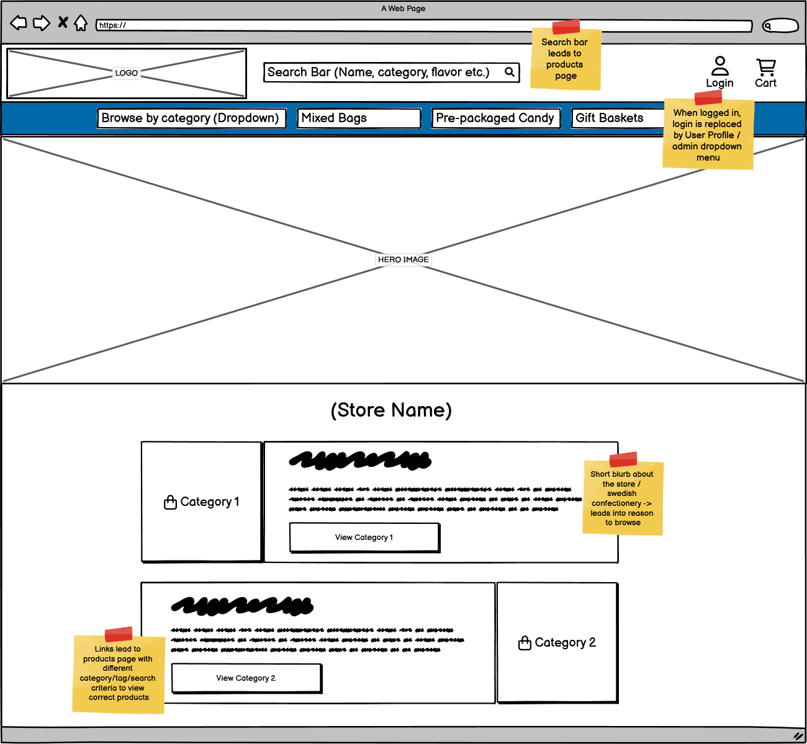

# SWEtooth Candy Co. Shop
[SWEtooth Candy Co. Shop](https://swetooth-candy-co-c66a5c7b1ddf.herokuapp.com/) is an online candy store that brings the joy of Swedish confectionery right to your doorstep.
Whether creating your own candy mix or choosing from our pre-mixed selection, you're sure to find something sweet to your liking.

## Table of Contents
TABLE OF CONTENTS:

## UX

### User Demographic

SWEtooth Candy Shop was built for candy enthusiasts of all ages, adults looking for a taste of nostalgia, young adults celebrating special occasions or curious individuals simply looking to explore Swedish candy traditions.
For those wanting to share some sweetness, the store also offers gift solutions such as gift wrapping/boxes/baskets to turn their order into a delightful gift worth remembering.

### User Stories

The full project board can be found [here](https://github.com/users/AndreeeasN/projects/2)

#### As a visitor
- I can sign up so that I can store my order confirmations / billing info on my account
- I can recover my password so that I can keep using my account if I lose the password
- I can view specific categories so that I can easily find products I'm interested in without searching
- I can view product details so that I can see more information about my potential purchase
- I can select varying bag sizes so that I can order the amount I want
- I can add products to the cart so that I can purchase several products at once
- I can checkout the contents of my cart so that I can pay and receive my products

#### As an admin
- I can add/delete products so that the store can adjust what's being sold
- I can edit products so that the store can adjust product details
- I can sort through the admin menu so I can quickly find what I'm looking for

### Colour Scheme:
COLOR SCHEME:

### Typography:
FONTS USED:

## Wireframes
- Home page 

- Products page 

- Product Details page 

- Cart page 

- Checkout page 

## Database Schema
ERD:

## Features

### Existing Features

#### Navigation
 
- Header logo
    - Brings user to the home page on click
- Search bar
    - The Search bar allows the user to search for products by their name, description and product tags 
    
    - The search function is accessible from all pages, and the search results are displayed on the products page.
    - On smaller screens the search bar will be moved into the sidenav to save space.
- Mobile Navbar
    - On smaller screens the navigation bar only contains 3 elements: Browse, Login and Cart.
    - All hidden navigational elements are available from the Sidenav which can be opened using the "Browse" button
- Sidenav 
    
    - The side navigation can be opened by clicking "Browse by Category" from the desktop navigation bar, or the "Browse" button on mobile.
    - The sidenav contains all categories and a few subcategories.
    - All links lead to the products page using different category/tag/search criteria.
- Log in / Sign up 
    
    - When not logged in displays a link to log in or sign up
- Profile Name 
    
    - When logged in displays a dropdown menu where your user profile and log out button can be found.
    - If logged in as a superuser the "Add product" page and Admin Menu can be accessed from here.
- Cart 
    
    - Takes user to their cart on click
    - If cart currently contains items a red notification will be display the amount
        - "Cart" will also be replaced with the total of all contained items
- Back-to-top Button 
    
    - When scrolling a certain distance on longer pages, a button appears in the bottom right corner
        - Pressing this button will scroll back to the top of the page, helping the user should they want to scroll back to the top

#### Main Page
- Hero Image / Carousel 
    
    - A simple Bootstrap 5 carousel featuring 3 different images that can be scrolled through.
    - All images are clickable and lead to relevant pages.
    - Hidden on smaller screen sizes.
- Featured Content 
    
    - 3 cards featuring an image and some information about candy / available products.
    - All cards contain a link to their relevant pages

#### Products Page

- Products 
    
    - Products are displayed in grid pattern showing the product's name and price
    - Each product has it's own "Add to cart" button
        - If the product has sizes / variants this will be replace with a "Choose Options" button that leads to the relevant product details page where a size can be chosen.
    - If logged in as superuser each product will have 2 extra options:
        - "Edit" - Allows the user to change details about the product (Name, price, category, brand, tags, sizes, image etc.)
        - "Delete" - Removes the product from the database entirely
- "Sort By" Dropdown 
    
    - Allows the user to sort their search by name and price, either ascending or descending
    - Displays how many products are present in the current category/search
- Pagination 
    
    - When the amount of products in a category/search exceeds a maximum they are split into pages and a page selection bar is displayed at the bottom of the products page.
    - The page selector allows the following actions:
        - Jump one page forward / back
        - Jump to the first / last page
        - Jump to a page within 3 pages of the current one

#### Product Details Page
- Product details 
    
    - Displays detailed information about the specified product
        - Product image, name, price, quantity selector, description and "Add to cart" are always visible
        - Size/variant selector only displayed when product has sizes/variants available
            - On selecting a variant the product price label will update to reflect this change
    - If logged in as superuser the page will have 2 extra options:
        - "Edit" - Allows the user to change details about the product (Name, price, category, brand, tags, sizes, image etc.)
        - "Delete" - Removes the product from the database entirely

#### Cart Page
- Your Cart 
    
    - Displays all items the user has added to their cart
        - Each product displays the following:
            - Name, SKU, price, quantity and subtotal
            - If product has a size/variant it will also be displayed
        - The quantity of each item can be adjusted using the - and + buttons followed by "Update"
        - The "Remove" link will entirely remove the product from the cart
    - Tallies up the cost of all products and displays at the bottom
        - The grand total includes delivery fee
            - If the total exceeds a certain threshold the delivery will be free
    - The checkout button takes the user to the Checkout page
    - "Continue shopping" takes the user to the Products page
 
 #### Checkout Page
 - Checkout 
    
    - Form containing billing details, delivery address and payment information for completing the transaction
        - Form has a checkbox to save delivery information to user profile
            - Saved delivery information can be changed from user profile
            - Replaced with text to sign up/log in if not logged in
    - Displays simple order summary of all cart items and the grand total
    - "Adjust Cart" takes user back to the Cart page
    - The "Complete Order" button uses the form information to attempt a monetary transaction through Stripe.
        - On succesful payment the user is shown an order confirmation that is also sent to their registered email. 
        

#### User Account
- My Profile 
    
    - Displays a form containing delivery information if entered by user.
        - This information will auto-fill the form for delivery information during checkouts
    - Also provides a list of previous orders
        - By clicking the order number the user may see the full order confirmation 
        
- Sign in 

- Sign up 

- Sign out 

### Future Features
- Tag dropdown in product search
- Make "Update" quantity in cart automatic
- "About" page
- FAQ page